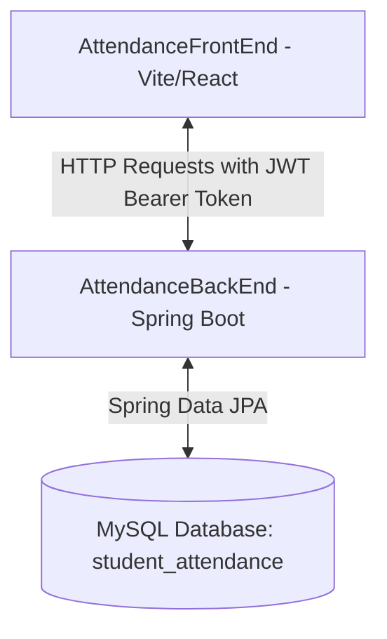
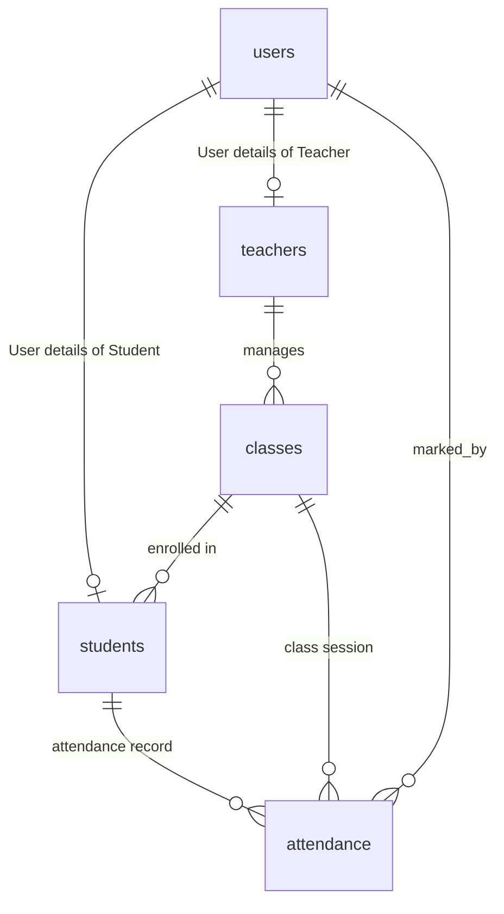
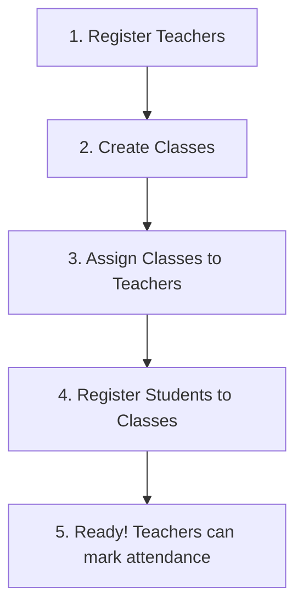

# Digital Attendance Management System

A modern, role-based Digital Attendance Management System designed to streamline student attendance tracking, reporting, and management. The project is split into a **Spring Boot REST API** backend and a **Vite + React (Material-UI)** frontend.

---

## 🏗️ System Architecture

The application is structured into two main components:
1. **AttendanceBackEnd**: A Spring Boot application providing secure REST APIs, role-based authorization (RBAC), and Hibernate-managed database operations.
2. **AttendanceFrontEnd**: A modern React Single Page Application (SPA) powered by Vite, Material-UI (MUI), Axios, and Zustand for state management.



### Key Features by Role

#### 🔑 Authentication & Security
- Secure login and profile update for all users.
- Role-Based Access Control (RBAC) enforced via Spring Security & Method Security (`@PreAuthorize`).
- Stateless session management using **JSON Web Tokens (JWT)**.
- Zustand store in React with local state persistence for keeping session active across refreshes.
- Secured `/api/auth/register` endpoint (Admin-only access).
- Automatic `AdminSeeder` bootstrapping to ensure a default admin exists on startup.

#### 👑 Administrator Portal
- **Dashboard**: High-level system overview stats.
- **Teacher Management**: Add, view, edit, and delete teachers. Assign them to departments.
- **Student Management**: Add, view, edit, and delete students. Assign them to classes and give unique roll numbers.
- **Class Management**: Create classes (by name, section, and subject) and assign them to teachers.
- **Attendance Registry**: Overlook, filter, and modify attendance records across all dates and classes.

#### 👨‍🏫 Teacher Portal
- **Class Overview**: View classes assigned specifically to the logged-in teacher.
- **Student List**: View rosters of all students enrolled in the teacher's assigned classes.
- **Mark Attendance**: Mark students `PRESENT` or `ABSENT` for any chosen date and class.
- **Attendance Reports**: Generate detailed reports by class and custom date ranges. Export/Print-ready views.

#### 🎓 Student Portal
- **Dashboard**: View overall attendance percentage, total classes held, number of days present/absent.
- **Attendance History**: Check individual attendance logs by date and class.
- **Search Filters**: Filter attendance history using custom date ranges.
- **Profile Page**: Update personal details (like contact number, address).

---

## 📁 Repository Directory Structure

```text
AttendanceManagement/
├── run-all.bat                        # Batch script to launch backend & frontend together
├── AttendanceBackEnd/                 # Spring Boot Backend
│   ├── src/
│   │   ├── main/
│   │   │   ├── java/com/example/AttendanceBackEnd/
│   │   │   │   ├── controller/        # REST Controllers (Auth, Student, Teacher, Classes, Attendance)
│   │   │   │   ├── dto/               # Data Transfer Objects (Requests/Responses)
│   │   │   │   ├── exception/         # Exception handling (GlobalExceptionHandler)
│   │   │   │   ├── model/             # JPA Entities (User, Student, Teacher, Classes, Attendance)
│   │   │   │   ├── repository/        # Spring Data JPA Repositories
│   │   │   │   ├── security/          # Spring Security, JWT validation, custom UserDetailsService
│   │   │   │   └── AttendanceBackEndApplication.java
│   │   │   └── resources/
│   │   │       └── application.properties # Database connection details, JWT secret keys, and ports
│   │   └── test/                      # Backend tests
│   ├── pom.xml                        # Maven Dependencies
│   └── mvnw / mvnw.cmd                # Maven Wrapper scripts
│
└── AttendanceFrontEnd/                # React Vite Frontend
    ├── src/
    │   ├── components/layout/         # Shared layouts (AdminLayout, TeacherLayout, StudentLayout, ProtectedRoute)
    │   ├── pages/                     # Routed pages grouped by role
    │   │   ├── admin/                 # Admin pages (Dashboard, Lists, Reports)
    │   │   ├── auth/                  # Auth pages (Landing, Login)
    │   │   ├── student/               # Student pages (Dashboard, History)
    │   │   └── teacher/               # Teacher pages (Dashboard, Mark, Reports)
    │   ├── services/                  # API communication layer (Axios base instance, auth, student, teacher services)
    │   ├── store/                     # Zustand state management stores (authStore)
    │   ├── utils/                     # Utility helpers (API instance, Polyfills)
    │   ├── App.jsx                    # Routing configuration
    │   ├── main.jsx                   # Entry point
    │   └── index.css / App.css        # Base stylesheet styling
    ├── vite.config.js                 # Vite bundler options
    └── package.json                   # NPM Dependencies
```

---

## 🗄️ Database Design

The database schema is automatically updated on boot by Hibernate Jpa based on the following relationship structure:



### Entity Schema Summary
- **User**: Stores login credentials (`username`, `password`, `email`), user's `fullName`, `phoneNumber` and `role` (an Enum: `ROLE_ADMIN`, `ROLE_TEACHER`, `ROLE_STUDENT`).
- **Teacher**: Contains department details, qualifications, and personal contact details.
- **Student**: Contains academic metrics like `rollNo`, references to the assigned `Classes`, and personal contact details.
- **Classes**: Groups a `subject`, a `section`, a `name`, and lists the assigned `Teacher` and enrolled `Student`s.
- **Attendance**: Connects `Student`, `Classes`, and the date (`LocalDate`). Stores status as `PRESENT` or `ABSENT`, along with `remarks` and a reference to the `User` who marked the attendance.

---

## ⚙️ Configuration Parameters

### Backend Settings (`AttendanceBackEnd/src/main/resources/application.properties`):
- **Server Port**: `5000` (Endpoints start at `http://localhost:5000/api`)
- **Database Path**: `jdbc:mysql://localhost:3306/student_attendance`
- **JPA DDL Action**: `update` (auto-creates tables)
- **JWT Key**: Configuration parameters for token generation (`jwt.secret` and `jwt.expiration`).

### Frontend Settings (`AttendanceFrontEnd/src/services/api.js`):
- **Base Endpoint**: Configured to request base URL `http://localhost:5000/api` (runs on default port 5000 as configured in the backend properties).
- **Vite Port**: Runs on `http://localhost:3000`.

---

## 🚀 Getting Started

### 📋 Prerequisites
- **Java Development Kit (JDK)**: Version 21.
- **Node.js**: Node 18 or above (recommended for React/Vite development).
- **MySQL Server**: Running on your local machine.

---

### 1. Database Setup
Log in to your MySQL environment and create a database named `student_attendance`:
```sql
CREATE DATABASE student_attendance;
```
*(Ensure that your database server username is `root` with no password, or edit `application.properties` to match your credentials)*

---

### 2. Run Both Servers (Simplified Method)
On Windows, you can start both the backend and frontend servers with a single command by double-clicking the `run-all.bat` script located in the project root, or running it from PowerShell:
```powershell
./run-all.bat
```
This opens two terminal windows to execute `./mvnw spring-boot:run` and `npm run dev` concurrently.

---

### 3. Run Manually (Alternative Method)

#### Boot Backend:
```bash
cd AttendanceBackEnd
# Windows Cmd/PowerShell:
./mvnw.cmd spring-boot:run
# Linux/macOS:
./mvnw spring-boot:run
```
The backend server will launch at `http://localhost:5000`. Open the Swagger API docs at `http://localhost:5000/swagger-ui.html`.

#### Boot Frontend:
```bash
cd AttendanceFrontEnd
npm install
npm run dev
```
The frontend web client will launch at `http://localhost:3000`.

---

## 🔑 Initial Authentication Credentials

The application uses an automated startup seeder. When the backend launches, it checks if an administrator user named `admin` exists in the database. If not, it generates the default admin account:

- **Username:** `admin` (or enter `admin` in the email login field)
- **Password:** `admin123`

To manage your registration and create new user roles, first log in using these details, then perform the onboarding setup below.

---

## 📋 Onboarding Flow (Setup Order)

Since the database starts empty, the administrator must register and link items in the following logical sequence to ensure data integrity:



1. **Register Teachers:** Go to *Admin -> Teachers -> Add Teacher*. Fill in details (this creates their profile and custom username/password).
2. **Create Classes:** Go to *Admin -> Classes -> Add Class* (specify name, subject, and section).
3. **Assign Classes to Teachers:** Go to *Admin -> Teachers*, click the **Assign Class** action icon on a teacher, and select the class they will teach.
4. **Register Students:** Go to *Admin -> Students -> Add Student*. Enter details, set their roll number, and assign them to their respective class.
5. **Mark Attendance:** Logout of Admin. Log in as a Teacher using the credentials you created. You will now be able to select your class and mark students present/absent!
